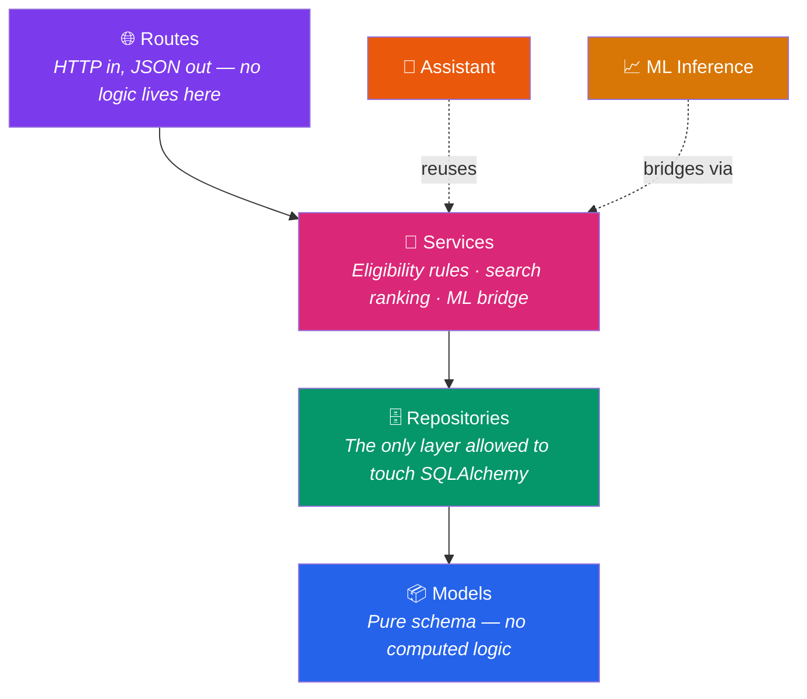
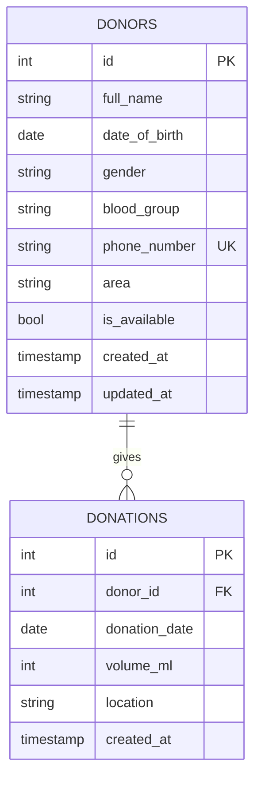
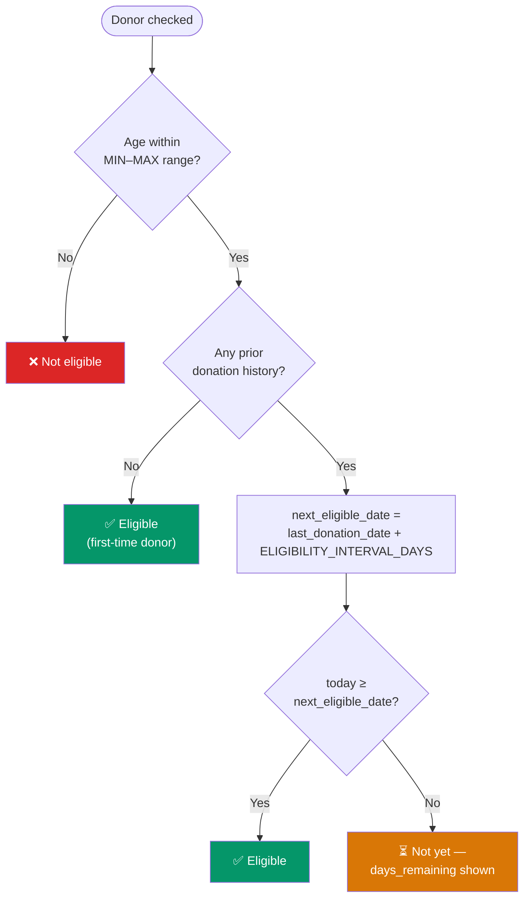
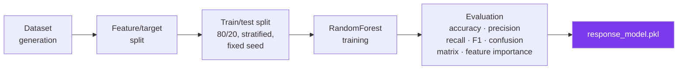

<div align="center">

# 🩸 LifeLine
### *The Blood Donor Registry & Availability Search*

**"Somewhere in Chennai, a phone number just went stale — and someone's life depends on the next one working."**

[](#tech-stack)
[](#architecture)
[](#database-schema)
[](#ml-prediction-workflow)
[](#running-tests)

</div>

---

## 🌆 The Problem, Told as a Story

It's 2 AM. A trauma case comes in needing O-negative blood, fast. Somewhere in a drawer is a clipboard, or maybe a spreadsheet three months out of date, listing donors who *might* still live in Tambaram, who *might* still have that number, who *might* still be eligible to give.

Nobody has time to call fifteen people to find one who picks up.

**LifeLine** exists to collapse that search from fifteen calls to one query: *blood group, area, eligibility — who's actually available, right now.* No stale numbers. No manual cross-referencing of "when did they last donate?" against a mental calendar. Just an answer, computed the moment it's asked.

---

## 🗺️ Table of Contents

- [The Shape of the System](#-the-shape-of-the-system)
- [Tech Stack](#tech-stack)
- [Project Structure](#-project-structure)
- [Database Schema](#-database-schema)
- [Setup](#-setup)
- [Running the App](#-running-the-app)
- [Running Tests](#-running-tests)
- [API Reference](#-api-reference)
- [How the Figures Are Calculated](#-how-the-figures-are-calculated)
- [The Prediction Engine](#-the-prediction-engine)
- [The Assistant](#-the-assistant)
- [Known Limitations — Said Out Loud](#-known-limitations--said-out-loud)
- [License](#license)

---

## 🏛️ The Shape of the System

Every request falls straight down through four honest layers — nothing sneaks sideways:



The payoff: eligibility logic, search ranking, and the donation-completion workflow are each unit-testable in total isolation — no live database, no HTTP context, no ceremony.

---

## Tech Stack

| Layer | Technology | Why it earned its place |
|---|---|---|
| Backend | Python 3.12, Flask | Lightweight, explicit control over layering |
| Database | SQLite (PostgreSQL-portable schema) | Zero-config for dev; migrates cleanly later |
| ORM | SQLAlchemy | Decouples business logic from raw SQL |
| Validation | Pydantic | Enforces request/response shape at the API boundary |
| ML | scikit-learn (`RandomForestClassifier`) | Right-sized for a small tabular classification problem |
| Assistant | Rule-based intent matching | The question set is small and enumerable |
| Frontend | HTML / CSS / JS, Chart.js | No build step; fetch-based, talks straight to the REST API |
| Testing | pytest | Unit + integration across every layer |

---

## 🗃️ Database Schema

Two entities. One relationship. Normalized to 3NF, deliberately.



**The design decision worth explaining:** `last_donation_date` and `total_donations` are *never* stored on `donors`. They're computed on demand — `MAX(donation_date)`, `COUNT(*)` — from the `donations` table every time. A cached column can only ever tell you "what's true right now." A history table can tell you "how long did it take" and "did it happen more than once." And if a donation record ever needs correcting, a cached column would quietly go stale the moment it did — the history table can't.

`donor_code` (e.g. `D000123`) is likewise never stored — it's a computed display value derived from the surrogate `id`.

Foreign keys are enforced at the SQLite level via `PRAGMA foreign_keys=ON`, set on every connection in `app/db.py`.

Full raw SQL reference: `sql/schema.sql`. Rendered ER diagram: `docs/er_diagram.png`.

---

## ⚙️ Setup

```bash
python -m venv venv

# Windows
venv\Scripts\Activate.ps1
# macOS/Linux
source venv/bin/activate

pip install -r requirements.txt

# Windows
copy .env.example .env
# macOS/Linux
cp .env.example .env
```

`.env` controls (all optional, sensible defaults provided):

```
DATABASE_URL=sqlite:///blood_donor.db
ELIGIBILITY_INTERVAL_DAYS=90
MIN_DONOR_AGE=18
MAX_DONOR_AGE=65
LOG_LEVEL=INFO
```

---

## 🚀 Running the App

Train the ML model first — skip this and predictions quietly fall back to a heuristic:
```bash
python -m app.ml.train
```

Seed the database (25 realistic donors, donation history, first-time-donor edge cases):
```bash
python -m app.seed
```

Start the server:
```bash
python main.py
```

| Route | What you'll find there |
|---|---|
| `/` | Donor search |
| `/register` | Register donors / update existing donors |
| `/dashboard` | Stats, charts, area heatmap |
| `/assistant` | Ask the assistant a question |
| `/constraints-demo` | Live demo of DB constraint errors (not in main nav) |

---

## 🧪 Running Tests

```bash
python -m pytest -v
python -m pytest --cov=app --cov-report=term-missing -v
```

Covers: database constraints (duplicate phone, future dates, FK violations, negative volume), eligibility boundary conditions, search filter combinations, assistant intent detection and formatting, ML pipeline correctness (no data leakage, valid metrics), and full API integration.

**End-to-end verification** (constraint errors, manual eligibility check, assistant isolation, prediction output) can be run and logged with:
```bash
python -m scripts.verify_task5 > verification_log.txt
```

---

## 🔌 API Reference

| Method | Endpoint | Description |
|---|---|---|
| GET | `/api/donors` | List all donors |
| POST | `/api/donors` | Register a new donor |
| GET | `/api/donors/{id}` | Get a single donor |
| PUT | `/api/donors/{id}` | Update donor details |
| GET | `/api/donors/lookup?phone_number=\|donor_id=` | Look up a donor for Mode 2 update |
| GET | `/api/donors/{id}/details` | Full profile bundle (donor + eligibility + totals) |
| GET | `/api/donors/{id}/donations` | Donation history for a donor |
| PATCH | `/api/donors/{id}/availability` | Manually toggle availability |
| POST | `/api/donors/{id}/complete-donation` | Full donation-completion workflow |
| POST | `/api/donations` | Log a donation directly |
| GET | `/api/eligibility/{id}` | Eligibility check with reason and days remaining |
| GET | `/api/search` | Filtered, ranked donor search |
| GET | `/api/prediction/{id}` | ML response-likelihood prediction |
| POST | `/api/assistant` | Natural-language-style query — `{"query": "..."}` |
| GET | `/api/dashboard` | KPI stats + chart data |
| GET | `/api/areas` | Canonical list of valid Chennai localities |

---

## 🧮 How the Figures Are Calculated

**Eligibility** (`app/services/eligibility_service.py`) — the logic behind every green or red badge in the UI:



- **Total donations**: `COUNT(*)` on `donations` for that donor — never stored, always queried fresh.
- **Last donation date**: `MAX(donation_date)` on `donations` for that donor.
- **Dashboard KPIs**: `total_donors` = row count on `donors`; `available_donors` / `eligible_today` = the *same* search and eligibility logic used everywhere else, not a parallel calculation path; `rare_blood_donors` = count in the fixed rare-group set (AB-, O-, AB+, B-); `donations_today` = count of donation rows dated today.
- **Prediction probability**: output of a trained `RandomForestClassifier.predict_proba()` — the next section explains exactly what it learned from.

---

## 📈 The Prediction Engine

**The question it answers:** if this donor is contacted right now for an emergency donation, how likely are they to actually respond? That's chosen deliberately — blood group and age are already known facts, but *will they pick up and show up* is the genuinely uncertain thing worth predicting.

**Features** (all knowable at prediction time — nothing leaks from the future): `age`, `days_since_last_donation`, `is_eligible`, `is_available`.



**The inference wrapper** (`app/ml/model.py`) deliberately does *not* import the training pipeline — it's a lightweight, standalone consumer of the saved model, so scikit-learn's training-only dependency weight never loads into a live web request.

> **Said plainly, not buried in a footnote:** the training data is currently **synthetic but logically structured** — not random noise, but simulated with eligible/available/recently-active donors given a higher response probability by design. No real historical "were they contacted, did they respond" data exists yet — there's no `contact_log` table in the schema. This is flagged on purpose rather than dressed up as real outcomes. The honest next step is adding that table and retraining against genuine history.

---

## 💬 The Assistant

Rule-based and intent-aware, not a chatbot pretending otherwise. It normalizes input (lowercase, trim, strip punctuation — except `+`/`-`, which mean something in blood group codes) and answers with **only the fields the question actually needs**, not a fixed full profile every time.

| Ask it... | And it understands... |
|---|---|
| *"List donors in Tambaram"* | Filter by area |
| *"Available O+ donors"* | Blood group + availability, combined |
| *"Eligible donors"* | Eligibility filter |
| *"Show donor details of Arun Kumar"* | Full donor profile |
| *"How many A- donors exist?"* | Count query, with donor cards attached |

---

## 🔍 Known Limitations — Said Out Loud

Being upfront about these matters more than pretending they don't exist:

- ML training data is synthetic, not sourced from real historical contact outcomes.
- No authentication or authorization layer — a single trusted internal role is assumed.
- Same-day duplicate donation entries are *allowed* with a logged warning, not hard-blocked — legitimate exceptions exist (e.g. a clerical correction).
- Dashboard auto-refresh is interval-based polling (every 15s), not WebSocket push.
- The area list and eligibility policy are specific to Chennai/India — not localized per region.
- Low-confidence predictions aren't currently suppressed or visually flagged as distinct from high-confidence ones.

---

## License

Educational/assessment project — not licensed for production or commercial use as-is.

<div align="center">

*Built so the next 2 AM search takes one query, not fifteen phone calls.*

</div>
